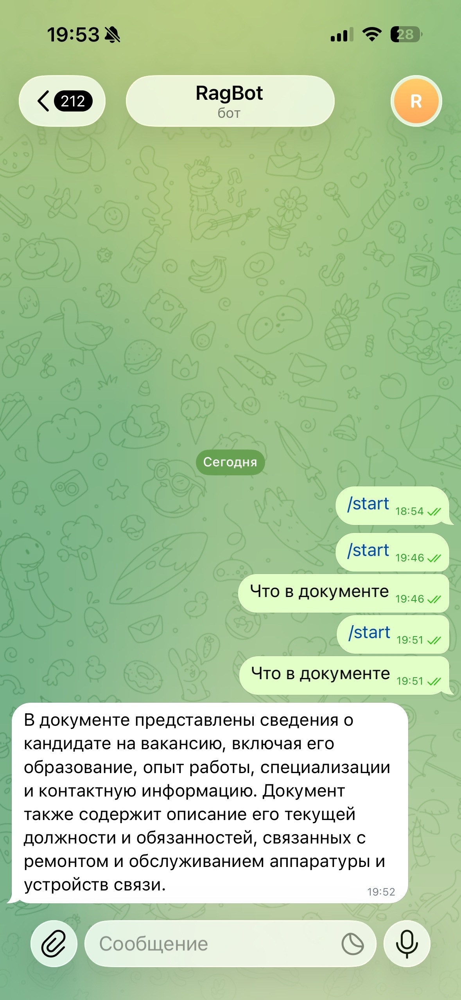
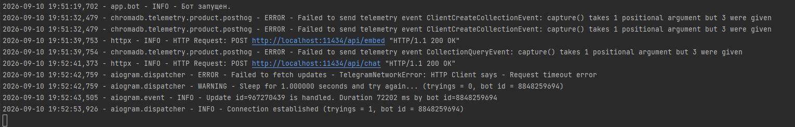

# RAG Telegram Bot

Telegram-бот с **RAG (Retrieval-Augmented Generation)** на локальной LLM. Отвечает на вопросы по загруженным PDF-документам, не отправляя данные в облако.



## ✨ Возможности

- 🤖 **Локальная LLM** — Ollama + Qwen2.5 7B (4-bit), без облачных API
- 📚 **RAG-пайплайн** — загрузка PDF → чанкинг → эмбеддинги → векторный поиск
- 🔍 **Векторная БД** — ChromaDB для семантического поиска
- 💬 **Telegram-бот** — aiogram 3.x, команды `/start`, `/help`, `/stats`
- 📝 **Логирование** — все диалоги сохраняются в SQLite
- 🐳 **Docker** — запуск одной командой
- 🧪 **10 тестов (pytest)** — БД и RAG-пайплайн
- 🎯 **Честные ответы** — если в базе знаний нет информации, бот скажет об этом

## 🛠 Стек

| Слой | Технология |
|---|---|
| Telegram | aiogram 3.15 |
| RAG-фреймворк | LangChain 0.3 |
| LLM | Ollama + Qwen2.5 7B Instruct (Q4_K_M) |
| Эмбеддинги | nomic-embed-text (Ollama) |
| Векторная БД | ChromaDB 0.5 |
| Парсинг PDF | pypdf 5.1 |
| Логи | SQLite |
| Тестирование | pytest 8.3 |
| Контейнеризация | Docker + docker-compose |

## 🚀 Быстрый старт

### Требования

- Python 3.11+
- [Ollama](https://ollama.com/download)
- Telegram-бот (токен от [@BotFather](https://t.me/BotFather))

### 1. Установка Ollama и моделей

```bash
ollama pull qwen2.5:7b-instruct-q4_K_M
ollama pull nomic-embed-text
```

### 2. Клонирование и настройка

```bash
git clone https://github.com/SmailsZX/rag-telegram-bot.git
cd rag-telegram-bot
cp .env.example .env
# Открой .env и вставь свой BOT_TOKEN
```

### 3. Установка зависимостей

```bash
python -m venv venv
venv\Scripts\activate           # Windows
# source venv/bin/activate      # Linux / Mac
pip install -r requirements.txt
```

### 4. Индексация документов

Положи PDF-файлы в папку `data/` и запусти:

```bash
python -m scripts.index_documents
```

### 5. Запуск бота

```bash
python main.py
```

Открой бота в Telegram и напиши `/start`.

## 🐳 Запуск через Docker

### Требования
- Docker Desktop
- Ollama на хосте (с моделями `qwen2.5:7b-instruct-q4_K_M` и `nomic-embed-text`)
- PDF-документы в `data/` (индексация — **до** запуска Docker, локально)

### Запуск

```bash
docker-compose up --build
```

**Что произойдёт:**
- Соберётся образ приложения (Python 3.11-slim)
- Запустится контейнер `rag-telegram-bot`
- Бот подключится к Ollama на хосте через `host.docker.internal:11434`
- Запустится polling в Telegram

### Остановка

```bash
docker-compose down
```

### Как это устроено

- **Ollama** — работает на хосте, контейнер обращается через `host.docker.internal:11434`.
- **Volumes** — `data/`, `chroma_db/` и `chat_history.db` монтируются с хоста, данные не теряются.
- **`.env`** — передаётся в контейнер через `env_file`.

### Важно
- **Индексация** (`python -m scripts.index_documents`) делается **локально** — ChromaDB сохраняется в `chroma_db/`, который монтируется в контейнер.
- **VPN** (если Telegram API заблокирован) — должен работать в режиме TUN, чтобы контейнер видел сеть.

## 🧪 Тесты

Проект покрыт тестами (pytest) — **10 тестов**.

### Запуск

```bash
pytest tests/ -v
```

### Что покрыто

**Логирование (`tests/test_database.py`):**
- ✅ Создание таблицы `messages`
- ✅ Запись пары вопрос-ответ
- ✅ Счётчик сообщений пользователя
- ✅ Пустой счётчик для нового пользователя

**RAG-пайплайн (`tests/test_rag.py`):**
- ✅ Форматирование документов (пустой / один / несколько)
- ✅ Системный промпт (grounding, `{context}`)
- ✅ Пользовательский промпт (`{question}`)
- ✅ Правило против галлюцинаций

## 📁 Структура проекта

```
rag-telegram-bot/
├── app/
│   ├── __init__.py
│   ├── config.py          # Настройки из .env
│   ├── prompts.py         # Системные промпты
│   ├── database.py        # SQLite-логирование
│   ├── indexer.py         # Индексация PDF → ChromaDB
│   ├── rag.py             # RAG-пайплайн
│   └── bot.py             # aiogram-бот
├── scripts/
│   └── index_documents.py # CLI для индексации
├── tests/                 # Тесты (pytest)
│   ├── conftest.py
│   ├── test_database.py
│   └── test_rag.py
├── data/                  # PDF-документы
├── chroma_db/             # Векторная БД (создаётся автоматически)
├── docs/                  # Скриншоты
├── .env.example
├── Dockerfile
├── docker-compose.yml
├── pytest.ini
├── requirements.txt
└── main.py
```

## 🧠 Как это работает

1. **Индексация:** PDF → чанки (1000 символов, overlap 200) → эмбеддинги через `nomic-embed-text` → ChromaDB.
2. **Запрос:** вопрос → эмбеддинг → поиск top-3 релевантных чанков в ChromaDB.
3. **Генерация:** контекст + вопрос → системный промпт → Qwen2.5 → ответ.
4. **Ответ:** бот отправляет ответ в Telegram и логирует пару вопрос-ответ в SQLite.

## 📸 Скриншоты

**Диалог с ботом:**


**Логи работы:**



## 🔒 Безопасность

- **Локальная LLM** — данные не уходят в облако.
- **`.env` в `.gitignore`** — токен бота не попадает в репозиторий.
- **Промпт-ограничения** — модель отвечает только по контексту, не выдумывает.

## 🔮 Roadmap

- [x] **Docker** — запуск одной командой
- [x] **pytest** — тесты на БД и RAG (10 тестов)
- [ ] Поддержка нескольких документов с указанием источника
- [ ] История диалогов с контекстом (multi-turn)
- [ ] Streaming-ответы
- [ ] Веб-интерфейс на FastAPI
- [ ] Метрики качества (RAGAS)

## 📄 Лицензия

MIT — используй свободно.